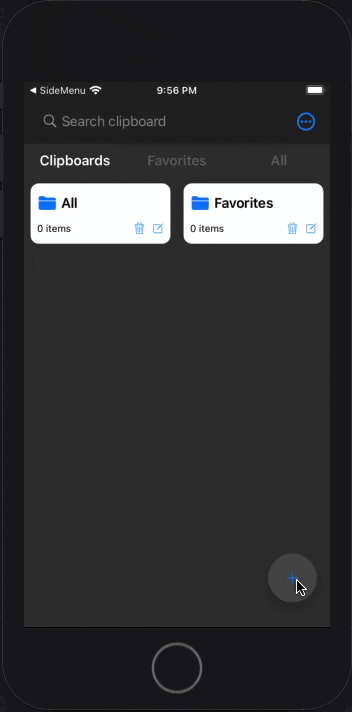
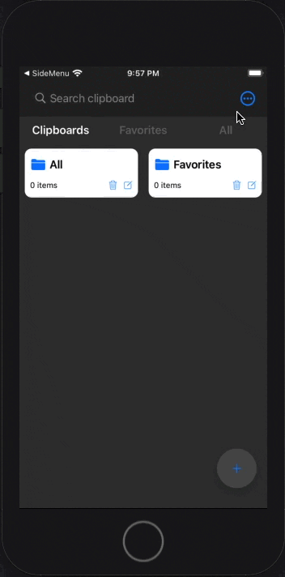

# Popup Kit

This swift package aims to create interactive popups (dialog, toast, and more) accessible.

## Features 

- configurable pop-up origin: top, center, and bottom
- configurable transition animation: bounce, zoom, and fade
- configurable pop-up size: fullscreen, half-screen, third-of-screen, quarter-of-screen, minimum-height-required, fixed-height
- configurable timer interval to create toast
- add rounded corners if needed
- add insets
- dim background view when presenting

## Requirements

- iOS 14.1+
- Swift 5.0+

## Credits

- Darryl Weimers
